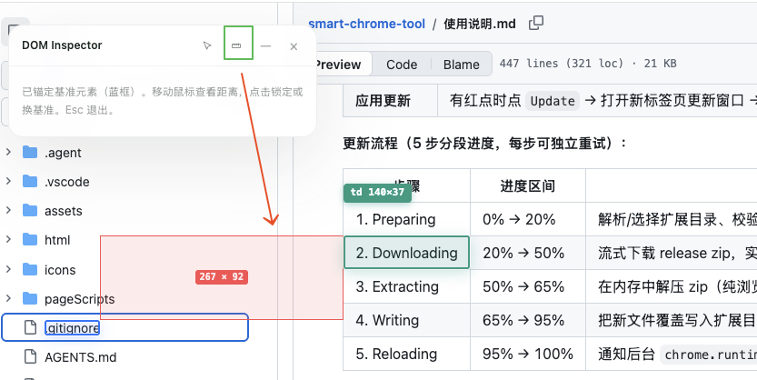

# Core Feature Catalog — smart-chrome-tool (MockKit)

> **This is a living document.** Every agent that adds or changes a core
> feature MUST update this file in the same change — see
> [`../standards/governance.md`](../standards/governance.md).
>
> Format per entry: name, one-line summary, where it lives, how it's wired.
> Keep entries concise; link to source files with `path:line`.

---

## 1. Response interception & rewriting

**Summary:** Override XHR/fetch response bodies for matched requests, by URL +
method, using literal substring or regex matching. Override text can be raw
JSON or a function string executed against request args.

**Lives in:**
- Matching & override: `pageScripts/index.js` (`getMatchedInterface`,
  `getOverrideText`, `executeStringFunction`)
- Rule storage & UI: `html/iframePage/main/hooks/useRegistry.ts`,
  `components/ModifyDataModal/`
- Config push: `content.js` (relays `ajaxDataList` to page script)

**Wiring:** Workbench → `chrome.storage.local.ajaxDataList` →
`storage.onChanged` → content `postMessage` → page script → patched XHR/fetch.

---

## 2. Request rewriting (URL / method / headers)

**Summary:** For a matched rule, rewrite the outgoing request URL, HTTP
method, and/or headers before the request leaves the page.

**Lives in:**
- Patched XHR/fetch open/send: `pageScripts/index.js`
- Editor: `html/iframePage/main/components/ModifyDataModal/` (Request tab)
- Type: `ModifyDataModalOpenProps` (`replacementMethod`, `replacementUrl`,
  `headersText`) in `main/types/registry.ts`

---

## 3. Request payload script injection

**Summary:** Run a user-supplied JS function string against the parsed request
params before sending, to dynamically transform the payload.

**Lives in:**
- `pageScripts/index.js` → `executeStringFunction`, `getRequestParams`
- Editor: `ModifyDataModal` (Request tab, `requestPayloadText`)

---

## 4. Per-page request header rules (declarativeNetRequest)

**Summary:** Set/remove request headers per origin using MV3
`declarativeNetRequest` dynamic rules. Compiled from header profiles in the SW;
applies even when the page script can't (e.g. cross-origin). One-click enable
per profile.

**Lives in:**
- Rule compilation: `service_worker.js` (`compileDynamicRules`,
  `syncHeaderRules`, `buildRuleId`, `normalizeHeaderOperations`)
- Storage: `ajaxToolsHeaderProfiles`, `ajaxToolsManagedHeaderRuleIds`
- UI: `html/iframePage/main/components/PageHeadersModal/`,
  `hooks/usePageHeaders.ts`
- Sync trigger: `SYNC_PAGE_HEADERS_RULES` message + `storage.onChanged`

**Rule-ID model:** `930000 + hash(profileId:ruleId) % 70000`; forbidden headers
filtered (`FORBIDDEN_REQUEST_HEADERS`).

---

## 5. CSR mode toggle

**Summary:** Toggle client-side rendering for the active tab by adding/removing
`__csr=1` URL param via `chrome.tabs.update`.

**Lives in:**
- `service_worker.js` (`getPageRenderMode`, `setPageRenderMode`,
  `buildRenderModeUrl`)
- `html/iframePage/main/hooks/usePageRenderMode.ts`
- Floating panel button: `content.js` (`createFloatingCsrButton`,
  `syncFloatingCsrBtnState`)
- Messages: `GET_PAGE_RENDER_MODE`, `SET_PAGE_RENDER_MODE`

---

## 6. Domain whitelist

**Summary:** Gate the mock layer and floating panel to specific host patterns
(`*`, `*.foo.com`, `api.foo.com`). Default `['*']` = all hosts.

**Lives in:**
- Matching: `content.js` (`patternToRegExp`, `isHostnameWhitelisted`,
  `currentHostWhitelisted`, `applyFloatingPanelState`)
- Storage: `ajaxToolsDomainWhitelist`
- UI: `html/iframePage/main/hooks/useDomainWhitelist.ts`,
  `components/OperationsRail/` (Domain Whitelist section)

---

## 7. Floating rules panel

**Summary:** A lightweight DOM panel rendered by `content.js` directly on the
page (not React), showing current group's rules with on/off toggles, hit dots,
drag-to-move, collapse, CSR + inspect buttons. Lets users toggle rules without
opening the full workbench.

**Lives in:**
- `content.js` (`createFloatingRulesPanel`, `renderFloatingRules`,
  `refreshFloatingHitDots`, `bindFloatingPanelDrag`, `createFloatingCsrButton`,
  `createFloatingInspectButton`, `applyFloatingPanelState`)
- Storage: `ajaxToolsFloatingRulesEnabled`, `ajaxToolsFloatingRulesCollapsed`
- Toggle: `html/iframePage/main/hooks/useFloatingRules.ts`

---

## 8. DOM Inspector (审查元素)

**Summary:** A self-contained DevTools-style element inspector (no DevTools
API) with two modes, each entered from its own entry on the DOM Inspector
panel header (the top-left draggable panel created by `showDomInspectorPanel`
— NOT the mock floating rules panel at bottom-right):

- **Inspect mode** (green aim icon, or the workbench DOM Inspect button): pick
  a node → show a draggable panel with selector, Core Styles table (editable
  colors via native picker, live inline-style writes), editable size box,
  Chrome-style box model diagram, and a collapsible full computed-styles list.
  One-shot: click picks, then exits.
- **Measure mode** (red ruler icon — visually distinct from the green aim
  icon): anchor+hover distance measurement. First click anchors baseline A
  (persistent blue box); hovering draws a red guide from A to the hovered
  element; second click locks B; subsequent clicks replace A. Esc exits.
  Distance rendering adapts to the two rects' relative position: vertical line
  + single value when horizontally overlapping, horizontal line + single value
  when vertically overlapping, semi-transparent red gap rect with centered
  "h × v" label when offset on both axes.

  

**Active-state indicators (both modes):** every inspector entry button shows a
solid active state while its mode is on, synced across ALL entry points by
`syncInspectorEntryButtons()` (queries by class, so it survives the DOM
Inspector panel being destroyed/rebuilt — the old single-ref `measureBtn`
approach lost sync on rebuild). It is called from `startDomInspector`,
`stopDomInspector`, AND at the end of `showDomInspectorPanel` — the last call
is essential because the reinspect/measure buttons are created inside
`showDomInspectorPanel`, so syncing only in `startDomInspector` (which runs
before the panel exists) left them without their `--on` state, and measure
mode's per-click panel rebuild kept wiping it:
- **Inspect** (green aim icon, 3 entry points: floating-rules panel aim, DOM
  Inspector panel reinspect, iframe OperationsRail): solid green background +
  tooltip switches to "Inspecting — click a node, Esc to cancel". One-shot —
  the indicator clears the moment a node is picked (inspect exits) or Esc is
  pressed.
- **Measure** (red ruler icon): solid red background + pulsing box-shadow
  animation + tooltip switches to "测距已开启". Stays on until toggled off or
  Esc. The two modes are mutually exclusive; starting one stops the other, and
  every entry button stops a conflicting active mode first (cross-mode
  stop-then-start) so switching is always possible from any entry.

**Hover-overlay color is mode-aware** so the user can tell inspect vs measure
apart from the selection border alone, not just the buttons:
- Inspect mode → green border (`#1a9b7f`) + green label.
- Measure mode → orange border (`#fa8c16`) + orange label for the hovered
  element B, kept distinct from the blue anchor A and the red measurement
  guides.

**Panel distinction (do not confuse):**
- **DOM Inspector panel** (`mockkit-dom-inspector*`, top-left, created by
  `showDomInspectorPanel`): shows node details / hints; hosts BOTH the inspect
  (aim) and measure (ruler) entry buttons on its header.
- **Mock floating rules panel** (`mockkit-floating-rules*`, bottom-right,
  created by `createFloatingRulesPanel`): shows rule list; has its own inspect
  button but NO measure button.

**Lives in:** `content.js` (`startDomInspector`/`stopDomInspector` with `mode`
param, `syncInspectorEntryButtons`, `createDomInspectorMeasureButton`,
`computeAnchorMeasurement`, `drawMeasurements`, `updateAnchorOverlay`,
`renderFrame`, `pickDomNode`, `showDomInspectorPanel`); state in
`domInspectorState` (`mode`, `anchor`, `lockedTarget`, `anchorOverlay`,
`overlay`, `overlayLabel`, `measurements`).

**Trigger:** DOM Inspector panel header buttons (aim icon → inspect, ruler
icon → measure), or `MOCKKIT_INSPECT_DOM` message from iframe
(`components/OperationsRail/index.tsx` DOM Inspect button → inspect mode).

**Interaction model:** Inspect = click-to-pick-then-exit. Measure =
click=anchor/lock/replace-baseline (never exits), Esc=exit, hover=live
measurement. The two modes are mutually exclusive; starting one stops the
other.

**Mark by Class (sub-module):** An independent module at the bottom of the
DOM Inspector panel (below Element Box / Computed Styles). The user types a
CSS class name (without the dot) and presses Enter or clicks "Mark" — every
matching element on the page gets a purple outline (`#7c3aed`) with a
numbered badge in the top-left corner. A status line shows the match count
(e.g. "3 elements marked .foo — press Esc to clear"). Autocomplete
suggestions are built on first input focus from the page's unique class
names (capped at 200 entries). Marks are cleared via Esc or a "Clear"
button. Overlays persist on `document.body` across panel rebuilds and are
repositioned on scroll/resize via a rAF-throttled handler. State lives in
`domInspectorState` (`markOverlays`, `markBadges`, `markInputValue`,
`markClassName`, `markKeyListener`).

**Lives in:** `content.js` (`buildMarkByClassModule`, `applyClassMarks`,
`clearClassMarks`, `repositionClassMarks`, `scheduleMarkReposition`); CSS
classes `mockkit-dom-inspector__mark-*`.

---

## 9. Request Sniffer (live capture)

**Summary:** Capture live XHR/fetch traffic on the page and list method/URL/
status/response; each row can be promoted to a mock rule in the selected group
with one click. Static assets filtered out.

**Lives in:**
- Emission: `pageScripts/index.js` (`emitCapturedRequest`)
- Relay: `content.js` → iframe
- State/UI: `html/iframePage/main/hooks/useRequestSniffer.ts`,
  `components/RequestSniffer/`, `components/OperationsRail/`
- Message: `AJAX_TOOLS_CAPTURED_REQUEST`

---

## 10. Import / Export

**Summary:** Back up and restore rule groups as JSON. Replace or append mode.

**Lives in:**
- `html/iframePage/main/utils/importJson.tsx`, `utils/exportJson.tsx`
- `components/BatchImportExport/`
- `useRegistry.onBatchImport` / `onImportClick`

---

## 11. Self-update from GitHub Releases

**Summary:** Periodically (6h alarm) and on-demand check GitHub Releases for a
newer version. API-first with HTML-scrape fallback (rate-limit resilient).
Download/unzip/write runs in a top-level extension page (`#update=1…`) because
the File System Access API is blocked in third-party iframes. Apply triggers
`chrome.runtime.reload()` + target-tab refresh.

**Lives in:**
- Check + fetch: `service_worker.js` (`checkForUpdate`,
  `fetchLatestRelease`, `fetchLatestReleaseViaHtml`, `compareVersions`)
- Download/unzip/write: `html/iframePage/main/utils/selfUpdate.ts`,
  `components/UpdateModal/`
- Storage: `ajaxToolsUpdateAvailable`, `ajaxToolsUpdateLastCheckAt`,
  `ajaxToolsGithubToken`
- Messages: `CHECK_UPDATE`, `RELOAD_EXTENSION`, `SET_GITHUB_TOKEN`

---

## 12. Workbench panel chrome (zoom / fullscreen / PiP / theme)

**Summary:** Toolbar buttons on the mounted iframe panel: zoom, fullscreen,
picture-in-picture, dark-theme (invert), open-in-new-tab, discussions, code-net.

**Lives in:** `content.js` (`actionBar`, `zoomButton`, `fullscreenButton`,
`pipButton`, `themeModeButton`, `newTabButton`, `discussionsButton`,
`codeNetButton`); PiP util `html/iframePage/main/utils/pictureInPicture.ts`.

---

## 13. DevTools panel entry

**Summary:** A Chrome DevTools panel (sibling of Elements / Console / Network)
that mounts the same React workbench on the inspected page. Serves as an
alternative entry point to the toolbar action, useful where the toolbar
action's content-script auto-injection is gated (e.g. enterprise-managed
browsers) — the DevTools page is permitted in many such environments and
`chrome.scripting.executeScript` re-injection still works through the
extension's existing `host_permissions`.

**Lives in:**
- Panel registration: `devtools.html` → `devtools.js`
  (`chrome.devtools.panels.create`)
- Panel UI + mount trigger: `panel.html` → `panel.js`
  (reads `chrome.devtools.inspectedWindow.tabId`, sends
  `DEVTOOLS_SHOW_WORKBENCH` to the service worker)
- Mount handler: `service_worker.js` (`DEVTOOLS_SHOW_WORKBENCH` branch — sets
  the workbench target tab, calls `ensurePanelMessageReceiver`, force-reveals
  the iframe via `iframeToggle`)
- Manifest: `devtools_page: "devtools.html"`

**Wiring:** DevTools panel open → `panel.js` →
`chrome.runtime.sendMessage({ type: 'DEVTOOLS_SHOW_WORKBENCH', tabId })` →
SW reuses `ensurePanelMessageReceiver` + `iframeToggle` (force-show) →
existing content.js iframe workbench on the inspected page. No new UI is
rendered inside the panel itself; the panel only shows mount status and a
retry button.

**Constraint:** Cannot mount on `chrome://`, `chrome-extension://`, `edge://`,
`about:`, or `view-source:` pages — Chrome blocks content-script injection on
those schemes regardless of entry point. The panel detects this and shows a
"blocked" status.

---

<!-- NEW FEATURES GO HERE
When adding a core feature, append a new numbered section above this comment
following the same format (Summary / Lives in / Wiring). See governance.md. -->
