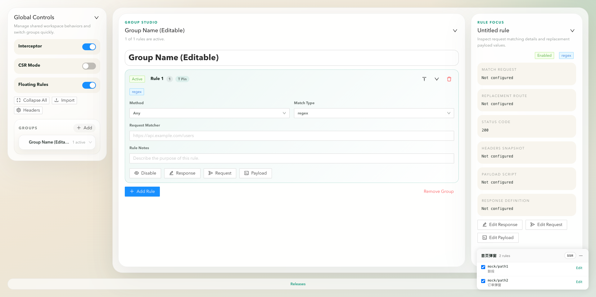
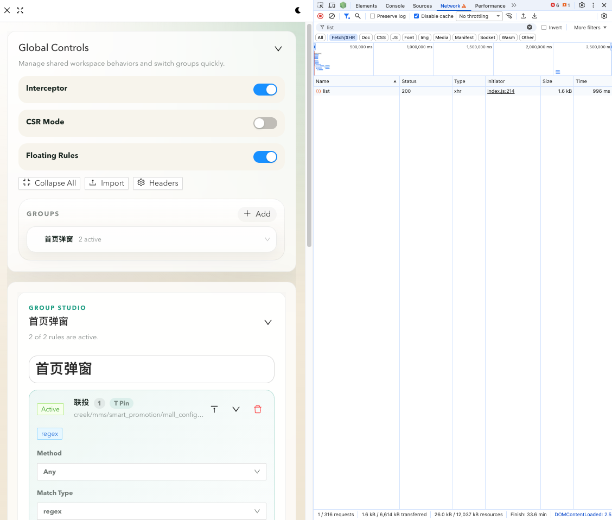
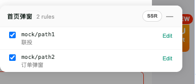

# smart-chrome-tool

`smart-chrome-tool` 是一款 Chrome 浏览器扩展，用于前端调试场景下拦截网络请求、改写响应、调整请求头，以及管理页面级请求头规则。

扩展内置一个基于 React + TypeScript 的 iframe 工作台，支持以下能力：

- 将拦截规则按分组组织
- 按 URL 与 HTTP 方法匹配请求
- 替换响应内容
- 改写请求 URL、方法与请求头
- 通过脚本注入对请求体进行转换
- 一键启用/停用当前页面的请求头规则
- 通过 `__csr=1` URL 参数切换当前标签页的 CSR（客户端渲染）模式
- 通过域名白名单控制 Mock 层与悬浮框的生效范围
- 导入与导出规则配置

> 英文文档请见 [README.md](./README.md)。
> 非技术人员可参考最简版使用说明：[使用说明.md](./使用说明.md)。

## 截图

| 模式 | 预览 |
| --- | --- |
| 全屏模式 |  |
| 正常模式 |  |
| 悬浮框模式 |  |

## 目录

- [架构概览](#架构概览)
- [项目结构](#项目结构)
- [环境要求](#环境要求)
- [本地开发](#本地开发)
- [构建扩展运行时](#构建扩展运行时)
- [在 Chrome 中加载扩展](#在-chrome-中加载扩展)
- [如何打开工具](#如何打开工具)
- [工作台概览](#工作台概览)
- [悬浮规则面板](#悬浮规则面板)
- [域名白名单](#域名白名单)
- [如何创建与管理规则分组](#如何创建与管理规则分组)
- [如何创建与编辑规则](#如何创建与编辑规则)
- [响应改写的工作机制](#响应改写的工作机制)
- [请求改写的工作机制](#请求改写的工作机制)
- [请求体脚本的工作机制](#请求体脚本的工作机制)
- [当前页请求头的工作机制](#当前页请求头的工作机制)
- [导入与导出](#导入与导出)
- [典型调试工作流](#典型调试工作流)
- [常见问题排查](#常见问题排查)
- [注意事项与限制](#注意事项与限制)
- [推荐使用约定](#推荐使用约定)
- [许可证](#许可证)

## 架构概览

本项目是一个基于 Chrome Manifest V3 的扩展。

主要运行时组成：

- `manifest.json`
  声明权限、content scripts、后台 service worker 以及 web accessible resources。
- `service_worker.js`
  处理后台运行时逻辑与 Chrome 扩展集成。
- `content.js`
  在匹配的页面中运行，在页面上下文中注入运行时能力。
- `html/iframePage/`
  包含基于 React + TypeScript 的 iframe 应用，作为管理 UI。

React iframe 应用是面向操作者的主 UI，使用 Vite 独立构建后被扩展加载。

## 项目结构

```text
smart-chrome-tool/
├── manifest.json
├── service_worker.js
├── content.js
├── pageScripts/
├── icons/
├── assets/
└── html/
    └── iframePage/
        ├── main/
        │   ├── App.tsx
        │   ├── hooks/
        │   ├── components/
        │   ├── common/
        │   └── types/
        ├── common/
        ├── index.html
        ├── package.json
        └── vite.config.js
```

关键前端文件：

- `html/iframePage/main/App.tsx`
  UI 重构后的工作台主入口。
- `html/iframePage/main/hooks/useRegistry.ts`
  规则分组的存储与变更核心逻辑。
- `html/iframePage/main/hooks/usePageHeaders.ts`
  当前页请求头配置的管理逻辑。
- `html/iframePage/main/components/ModifyDataModal/`
  基于 Monaco Editor 的高级请求与响应编辑弹窗。

## 环境要求

推荐环境：

- Node.js `16+`
- npm `8+`
- 已开启开发者模式的 Chrome 或 Chromium 浏览器

本仓库目前在 `html/iframePage` 内部单独管理 iframe 前端依赖。

## 本地开发

### 1. 安装前端依赖

在 iframe 应用目录下执行：

```bash
cd html/iframePage
npm install
```

### 2. 以开发模式启动 iframe 应用

```bash
npm run start
```

Vite 开发服务器地址：

```text
http://localhost:4001
```

此模式适合单独迭代 React UI。若需修改扩展运行时行为，仍需在 Chrome 中重新加载未打包扩展。

## 构建扩展运行时

扩展运行时会使用 `html/iframePage/dist` 中构建好的 iframe 资源。

构建 iframe 应用：

```bash
cd html/iframePage
npm run build
```

构建成功后，Vite 将产物输出至：

```text
html/iframePage/dist
```

该目录被 `manifest.json` 声明为 web accessible resource。

## 在 Chrome 中加载扩展

### 1. 先构建 iframe 应用

```bash
cd html/iframePage
npm run build
```

### 2. 打开 Chrome 扩展管理页

打开：

```text
chrome://extensions
```

### 3. 启用开发者模式

打开右上角的 `Developer mode`（开发者模式）开关。

### 4. 以未打包扩展形式加载

点击 `Load unpacked`（加载已解压的扩展程序），选择项目根目录：

```text
smart-chrome-tool/
```

### 5. 代码改动后重新加载

当修改 `manifest.json`、`service_worker.js`、`content.js` 等运行时文件时，在 `chrome://extensions` 中点击 `Reload`（重新加载）。

当修改 iframe React 应用时：

1. 重新构建 `html/iframePage`
2. 重新加载扩展
3. 刷新目标页面并重新打开工作台

## 如何打开工具

工作台以侧边面板的形式注入到当前页面中。

典型流程：

1. 打开目标网页。
2. 点击浏览器工具栏上的扩展图标（`Ajax Interceptor Tools`）。
3. 工作台面板会从页面右侧滑入。
4. 再次点击扩展图标（或面板的关闭按钮）即可隐藏面板。

如果面板未出现：

- 确认未打包扩展已成功加载
- 确认当前标签页是普通的 http/https 页面（`chrome://` 等页面无法注入面板）
- 确认 iframe 应用已成功构建（`html/iframePage/dist` 存在）
- 重新加载扩展后刷新目标页面

## 工作台概览

UI 重构后，主界面分为以下几个区域：

### 1. 顶部概览

顶部区域展示：

- 拦截器的全局状态
- 当前页请求头快速开关状态
- 分组数量
- 规则数量
- 已启用规则数量
- 正则规则数量

`Import JSON` 与 `Page Headers` 入口已迁移至左侧操作栏（对应 `Import` 与 `Headers`）。

### 2. 左侧操作栏

左侧面板包含：

- 全局拦截器启用/停用开关
- `CSR Mode` 开关 —— 切换当前标签页的渲染模式
- `Floating Rules` 开关 —— [悬浮规则面板](#悬浮规则面板)的总开关
- `Collapse All` / `Expand All` —— 一键折叠/展开分组工作区
- `Import` —— 导入 JSON 规则
- `Headers` —— 打开当前页请求头编辑器
- `Domain Whitelist` —— 编辑[域名白名单](#域名白名单)，并实时显示当前标签页是否命中
- 分组导航

可借助它快速切换分组，而不必扫视完整规则列表。

### 3. 主工作区

中间面板为当前活跃分组的编辑器，支持：

- 重命名分组
- 将分组置顶或置底
- 启用分组内全部规则
- 停用分组内全部规则
- 删除分组
- 行内编辑规则字段
- 打开高级请求/响应编辑器

### 4. 右侧详情面板

右侧面板展示当前聚焦的规则：

- 请求匹配条件
- 替换 URL
- 替换状态码
- 请求头快照
- 请求体脚本
- 响应定义

这样可以避免反复打开弹窗编辑器即可查看当前规则。

## 悬浮规则面板

悬浮规则面板独立于主侧边面板，固定在页面右下角（见[截图 - 悬浮框模式](#截图)）。它让你无需保持完整工作台展开，即可对当前分组的规则进行开关与编辑。

### 显示规则

- 仅在命中[域名白名单](#域名白名单)的页面上渲染。
- 总开关位于左侧操作栏的 `Floating Rules`，关闭后在所有页面隐藏。
- 悬浮框与主面板相互独立：折叠工作台不会隐藏悬浮框。

### 头部操作

- 头部**可拖拽** —— 可将面板拖到视口任意位置。位置仅保存在内存中，刷新页面后回到右下角默认位置。
- `CSR` / `SSR` 药丸按钮一键切换当前标签页的渲染模式（等价于操作栏的 `CSR Mode` 开关）。
- `—` 按钮将面板折叠为紧凑的 3×3 mock 小方格，下方显示 `已启用/总数` 计数。点击小方格即可展开。

### 规则行

- 每行展示匹配的 URL 与可选备注。
- 自定义药丸开关用于启用/停用规则（写回 storage，与工作台保持同步）。
- 悬停时出现 `Edit` 按钮 —— 点击后会展开主侧边面板，并为该规则打开编辑弹窗。

## 域名白名单

Mock 层（XHR/fetch 覆写）与悬浮规则面板都受域名白名单控制，确保扩展不会在非预期站点上静默拦截流量。

### 默认行为

- 白名单默认包含 `*`，匹配所有主机名。开箱即用与之前版本行为一致。
- 如果你清空所有条目，列表会回退为 `*`，避免误操作导致所有页面都被拦截。

### 支持的匹配模式

| 模式 | 匹配范围 |
| --- | --- |
| `*` | 所有主机名 |
| `foo.com` | 精确匹配 `foo.com` |
| `*.foo.com` | `foo.com` 及其任意子域（`a.foo.com`、`a.b.foo.com`） |
| `a*.foo.com` | `foo.com` 下以 `a` 开头的主机名（`ab.foo.com`、`ac.foo.com`） |

模式匹配大小写不敏感。

### 如何配置

1. 打开扩展工作台。
2. 在左侧操作栏找到 **Domain Whitelist** 卡片。
3. 卡片会显示当前标签页的主机名，并带有 `✓ matched` / `✕ blocked` 实时状态。
4. 在输入框中输入新模式后按回车（或点击 `+` 按钮）添加。
5. 点击标签上的 `×` 即可移除该模式。

### 受控范围

- **pageScripts/index.js** 仅在 `currentHostWhitelisted()` 返回 true 时才覆写 `XMLHttpRequest` 与 `fetch`。
- **content.js** 在非命中主机名上隐藏悬浮规则面板。
- 白名单持久化于 `ajaxToolsDomainWhitelist`，并通过 `storage.onChanged` 广播给页面脚本，修改后无需刷新即可在下次请求生效。

## 如何创建与管理规则分组

### 新建分组

有多种入口：

- 点击顶部的 `Create Group`
- 在分组导航中点击 `Add`

每个分组是相关规则的容器。推荐按以下维度组织：

- 业务域
- 页面模块
- API 体系
- 调试场景

示例：

- `Checkout Mock APIs`（结算 Mock 接口）
- `User Center Overrides`（用户中心覆盖规则）
- `Local Sandbox Rules`（本地沙箱规则）
- `Temporary Release Verification`（临时发布验证）

### 重命名分组

1. 在左侧导航中选中分组
2. 在主工作区编辑标题字段

建议使用语义清晰的名称，UI 会自动保存改动。

### 调整分组顺序

在当前分组头部：

- 点击 `Pin Top` 将分组置顶
- 点击 `Send Bottom` 将分组置底

### 删除分组

在当前分组头部：

- 点击 `Remove Group`

注意：删除分组会同时从本地存储中移除该分组下的全部规则。

### 启用或停用分组内全部规则

在当前分组头部：

- 点击 `Enable All`
- 点击 `Disable All`

适用于需要快速对比真实后端行为与 Mock 行为的场景。

## 如何创建与编辑规则

### 创建规则

1. 选中一个分组
2. 点击 `Add Rule`

每条规则包含若干关键字段。

### 匹配类型（Match Type）

支持的取值：

- `regex`
- `normal`

使用 `regex` 的场景：

- 需要模式匹配
- 请求 URL 含可变片段
- 希望一条规则匹配多个相似接口

使用 `normal` 的场景：

- 请求 URL 稳定
- 希望精确或更简单的匹配行为

### 方法（Method）

支持的常见方法：

- `GET`
- `POST`
- `PUT`
- `DELETE`
- `PATCH`
- 留空表示任意方法

留空时规则更宽松，可能匹配更多请求。

### 请求匹配条件（Request Matcher）

该字段是 URL 匹配的核心输入。

示例：

```text
https://api.example.com/user/profile
```

```text
/api/order/list
```

```text
^https://api\.example\.com/v1/items/.*
```

### 规则备注（Rule Notes）

用于记录规则目的，例如：

- `Force empty cart state`（强制购物车为空）
- `Mock user level to VIP`（Mock 用户等级为 VIP）
- `Simulate order create failure`（模拟下单失败）

当同一环境中存在大量临时规则时，备注会尤为重要。

### 启用或停用单条规则

在每条规则卡片内：

- 点击 `Enable`
- 点击 `Disable`

停用规则会保留配置，但不再生效。

### 移动规则

在每条规则卡片工具栏：

- 置顶
- 置底

适用于希望重要规则在分组中视觉上靠前。

### 删除规则

在每条规则卡片工具栏：

- 点击删除图标

## 响应改写的工作机制

在规则卡片上点击 `Response`，或在右侧详情面板点击 `Edit Response`。

弹窗中可配置：

- 替换状态码
- 替换响应体
- 响应语言模式

### 支持的响应编写模式

编辑器至少支持：

- `json`
- `javascript`

### JSON 模式

当响应静态且可预测时使用 JSON 模式。

示例：

```json
{
  "status": 200,
  "response": {
    "name": "debug-user",
    "role": "admin"
  }
}
```

### JavaScript 模式

当响应需要动态生成时使用 JavaScript 模式。

示例：

```javascript
const data = [];

for (let index = 0; index < 5; index += 1) {
  data.push({
    id: index,
    label: `item-${index}`
  });
}

return {
  status: 200,
  response: data
};
```

典型场景：

- 根据请求参数返回不同响应
- 模拟空状态
- 模拟分页响应
- 模拟错误分支
- 快速构造嵌套对象以供 UI 测试

## 请求改写的工作机制

在规则卡片上点击 `Request`，或在右侧详情面板点击 `Edit Request`。

该编辑器用于在响应处理阶段之前对上游请求进行改写。

可用能力：

- 替换请求方法
- 替换请求 URL
- 替换请求头

### 替换请求方法

可改变发出的方法，例如：

- `POST` 改为 `GET`
- `GET` 改为 `POST`

请谨慎使用，因为方法变更可能显著改变后端语义。

### 替换请求 URL

可将请求重定向到另一个接口。

示例：

```text
https://mock.example.com/api/user/detail
```

典型场景：

- 将类生产流量重定向到 Mock 服务
- 将某个接口重定向到另一个已存在接口
- 将请求路由到本地测试服务

### 替换请求头

请求头以 JSON 形式编辑。

示例：

```json
{
  "Content-Type": "application/json",
  "x-debug-mode": "1",
  "x-user-role": "tester"
}
```

常见场景：

- 为预发环境添加鉴权类请求头
- 为后端分支添加调试开关
- 模拟特殊用户身份

## 请求体脚本的工作机制

在规则卡片上点击 `Payload`，或在右侧详情面板点击 `Edit Payload`。

该编辑器接受 JavaScript，用于在请求发送前对请求体进行转换。

典型场景：

- 增加额外查询参数
- 修改 JSON body 字段
- 追加 `FormData` 字段
- 模拟特殊筛选条件或功能开关

### 示例：改写 GET 请求的 query string

```javascript
const { requestUrl, queryStringParameters } = arguments[0];

let nextRequestUrl = requestUrl.split('?')[0] + '?';
const nextQuery = Object.assign(queryStringParameters, {
  debugMode: '1'
});

Object.keys(nextQuery).forEach((key, index) => {
  if (index !== 0) nextRequestUrl += '&';
  nextRequestUrl += `${key}=${nextQuery[key]}`;
});

return nextRequestUrl;
```

### 示例：修改 POST 的 JSON body

```javascript
const payload = JSON.parse(arguments[0]);

payload.role = 'tester';
payload.featureFlag = true;

return JSON.stringify(payload);
```

### 示例：向 FormData 追加字段

```javascript
const payload = arguments[0];

payload.append('debugMode', '1');

return payload;
```

## 当前页请求头的工作机制

工作台为当前页请求头提供了独立能力。

打开方式：

- 点击顶部的 `Page Headers`

或使用：

- 左侧操作栏的 `Quick Headers` 开关

### 该功能的作用

基于页面 origin 创建请求头规则，并通过扩展存储同步。

适用于为某个站点设置临时请求头策略，例如：

- 强制注入调试 token
- 添加预发环境标记
- 启用后端实验开关

### 如何配置当前页请求头

1. 打开目标页面
2. 打开扩展工作台
3. 点击 `Page Headers`
4. 开启该功能
5. 添加 header 键值对
6. 点击 `Save`

示例：

```text
Header Key: x-debug-mode
Header Value: 1
```

### 快速开关的工作方式

`Quick Headers` 开关：

- 若已存在配置，则立即启用已配置的请求头
- 启用时若没有历史配置，则创建默认请求头规则
- 关闭时停用当前页请求头规则

## 导入与导出

### 导入

使用顶部的 `Import JSON` 按钮。

导入行为：

- 导入的数组会追加到已有分组之后
- 不会自动清空已有存储

推荐流程：

1. 先导出或备份当前规则
2. 导入 JSON 文件
3. 在导航中确认导入的分组

### 导出

前端运行时内置了导出工具。若当前 UI 入口在运行环境中暴露了导出功能，可使用它将当前配置保存为 JSON，用于备份或团队共享。

推荐导出场景：

- 大规模规则改动前
- 删除分组前
- 切换分支或本地环境前
- 与队友分享已验证的 Mock 配置前

## 典型调试工作流

### 1. Mock 静态接口响应

1. 创建分组，例如 `Product Detail Mock`
2. 新增规则
3. 将请求匹配条件设为目标 API
4. 打开 `Response`
5. 填入 JSON 响应
6. 启用规则
7. 刷新页面并验证 UI 行为

### 2. 模拟空状态

1. 匹配列表接口
2. 用空数组或空对象替换响应
3. 验证 UI 空状态是否正确

示例：

```json
{
  "status": 200,
  "response": []
}
```

### 3. 模拟后端错误

1. 匹配目标 API
2. 打开 `Response`
3. 将状态码改为 `500` 或其他预期值
4. 返回错误结构的响应体
5. 验证错误 toast、兜底 UI 与重试逻辑

### 4. 为某个环境强制注入请求头

1. 打开目标页面
2. 打开 `Page Headers`
3. 添加所需键值对
4. 保存并启用
5. 刷新页面并查看 network 面板

### 5. 通过改写请求体进行实验

1. 匹配 `POST` 或 `GET` 接口
2. 打开 `Payload`
3. 编写脚本修改请求参数
4. 保存规则
5. 触发 UI 操作并检查实际发出的请求

## 常见问题排查

### 工作台面板没有出现

请检查：

- 扩展已在 `chrome://extensions` 中成功加载
- 当前标签页是普通的 http/https 页面（`chrome://` 等页面无法注入面板）
- `html/iframePage/dist` 目录存在
- `manifest.json` 配置合法
- 重新加载扩展后已刷新目标页面

### 规则不生效

请检查：

- 全局拦截器开关已启用
- 单条规则已启用
- 请求匹配条件正确
- 方法过滤正确
- 当前页面确实发出了你期望的请求
- 运行时改动后已重新加载扩展

### 页面请求头不生效

请检查：

- 页面 origin 合法
- 页面请求头功能已启用
- header 键不为空
- 扩展已获得相应 host 权限

### 构建成功但扩展仍显示旧 UI

请按顺序检查：

1. 重新构建 iframe 应用
2. 重新加载未打包扩展
3. 刷新目标页面
4. 再次点击扩展工具栏图标重新打开工作台

### `npm install` 或 `npm run build` 失败

请检查：

- Node.js 版本兼容性
- npm registry 配置
- 本地网络连通性
- 依赖 lockfile 状态

## 注意事项与限制

- 本项目依赖 Chrome 扩展 API，仅适用于基于 Chromium 的浏览器。
- iframe 应用需单独构建，扩展运行时必须存在 `html/iframePage/dist`。
- Monaco Editor 会使打包体积偏大，当前为预期行为。
- 规则数据存储在 Chrome 本地存储中，清除扩展存储会丢失已保存规则。
- 请求与响应改写属于强能力，在共享环境中请谨慎使用。

## 推荐使用约定

为保证规则数据的长期可维护性，建议遵循以下约定：

- 每个分组聚焦一个业务域
- 为规则填写有意义的备注
- 过时规则应及时停用，而非保留含糊的活跃规则
- 大改动前先导出重要规则集
- 临时分组使用 `TEMP`、`DEBUG`、`VERIFY` 等前缀命名

## 许可证

详见 [LICENSE](./LICENSE)。
