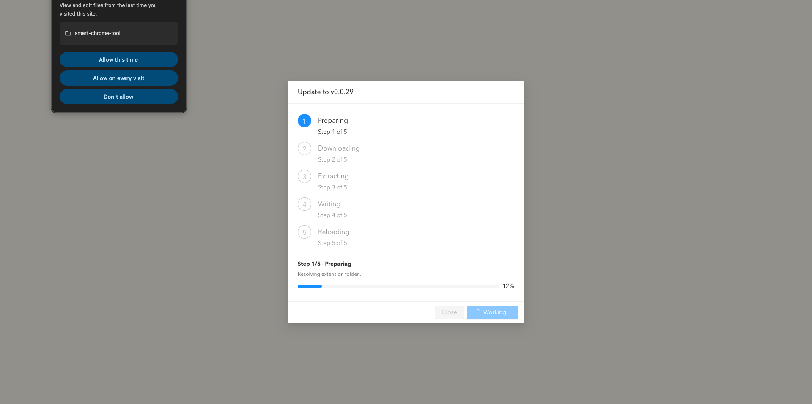
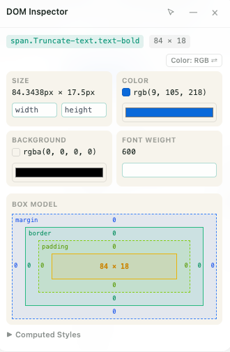

# Ajax Interceptor Tools 使用说明（最简版）

本工具是一个 Chrome 浏览器插件，用于拦截和修改网页请求。下面教你从零开始，三步搞定安装。

> 适用人群：非技术人员
> 准备工作：一台装了 Chrome 浏览器的电脑

---

## 第一步：下载压缩包

1. 打开下载页面：[https://github.com/robbiemie/smart-chrome-tool/releases](https://github.com/robbiemie/smart-chrome-tool/releases)
2. 在页面下方找到最新版本的 `Assets` 区域，点击其中的 `smart-chrome-tool-vX.X.X.zip` 文件开始下载（`vX.X.X` 为版本号，下载最新版即可）。
3. 保存到电脑上方便找的位置，例如「下载」文件夹或桌面。

---

## 第二步：解压压缩包

Chrome 不能直接使用 zip 压缩包，必须先解压成一个文件夹。

### Windows 系统
1. 右键点击下载好的 zip 文件（例如 `smart-chrome-tool-v0.0.4.zip`）。
2. 选择「解压到当前文件夹」或「全部解压」。
3. 解压后会出现一个同名文件夹，记住这个文件夹的位置。

### Mac 系统
1. 双击下载好的 zip 文件。
2. 系统会自动解压出一个同名文件夹。
3. 记住这个文件夹的位置（建议拖到「应用程序」或「文档」文件夹中，方便以后查找）。

> ⚠️ 注意：解压后的文件夹不要删除，插件运行时需要一直使用它。建议把它放到一个不会误删的固定位置。

---

## 第三步：在 Chrome 中加载插件

1. 打开 Chrome 浏览器。
2. 在地址栏输入下面的内容，然后回车：
   ```
   chrome://extensions
   ```
3. 在页面右上角找到「**开发者模式**」开关，把它打开。
4. 开关打开后，页面左上角会出现几个按钮，点击「**加载已解压的扩展程序**」（英文是 `Load unpacked`）。
5. 在弹出的文件选择窗口中，选择**第二步解压出来的文件夹**（注意要选中文件夹本身，不要进去选里面的文件）。
6. 点击「选择文件夹」。

如果一切顺利，扩展列表里会出现一个名为「**Ajax Interceptor Tools**」的插件卡片，说明安装成功！

---

## 第四步：如何使用

1. 打开你要调试的网页。
2. 找到浏览器右上角工具栏上的扩展图标（名为「**Ajax Interceptor Tools**」），点击它。
3. 工作台面板会从页面右侧滑入，你就可以开始配置拦截规则了。
4. 再次点击扩展图标（或点击面板左上角的关闭按钮）即可隐藏面板。

> 💡 如果找不到扩展图标：点击浏览器工具栏右上角的拼图图标（扩展程序），在列表中找到「Ajax Interceptor Tools」，点击它旁边的图钉图标将其固定到工具栏，方便以后使用。

---

## 常见问题

### Q1：加载时报错「找不到 manifest.json」？
说明你选错了文件夹。请确认选的是**解压后**的文件夹，并且这个文件夹里能直接看到一个叫 `manifest.json` 的文件。

### Q2：插件安装了，但点击图标后面板没出现？
1. 确认当前打开的是普通网页（`http://` 或 `https://` 开头），而不是 `chrome://` 之类的浏览器内置页面。
2. 刷新当前网页后再点击扩展图标。
3. 如果还是没有，回到 `chrome://extensions` 页面，点击插件卡片上的「刷新」按钮（圆形箭头图标），然后刷新网页重试。

### Q3：换了电脑怎么办？
重复上面三步即可。本插件的配置数据保存在 Chrome 本地，不会自动同步到新电脑。

### Q4：怎么更新到新版本？

**方式一：热更新（推荐）**
1. 打开任意命中域名白名单的页面，悬浮面板头部点 `Update` 按钮。
2. 若有新版本，按钮右上角会有小红点。点击后工作台弹出更新弹窗。
3. 点 `Install`，自动下载、解压、覆盖、重载。首次需选一次插件文件夹，之后免选。
4. 详见[模块十一：热更新](#模块十一热更新)。

**方式二：手动覆盖**
1. 下载并解压新版本的 zip 文件，覆盖旧文件夹（或解压到新位置）。
2. 到 `chrome://extensions` 页面，点击插件卡片上的「刷新」按钮（圆形箭头）。
3. 若解压到新位置，需先移除旧插件，再重新「加载已解压的扩展程序」。

### Q5：能不能不删旧文件夹直接覆盖更新？
可以，但建议先移除旧插件，再加载新文件夹，避免缓存导致的问题。

---

## 卸载方法

如果不再需要这个插件：
1. 打开 `chrome://extensions`。
2. 找到「Ajax Interceptor Tools」卡片。
3. 点击卡片右下角的「移除」按钮。
4. 确认移除即可。

---

## 小贴士

- 插件文件夹**不能删除或移动**，否则插件会失效。建议放到固定位置。
- 如果电脑重启后插件不见了，回到 `chrome://extensions` 重新启用即可。
- 使用过程中遇到问题，可以截图发给开发同事协助排查。

## 截图

### 热更新下载弹窗

点击 Footer 的 `Update` 后，会打开更新窗口，展示 5 步分段进度条、当前步骤名和下载进度，每步可独立重试。



### DOM 审查悬浮面板

点击悬浮面板的箭头图标或工作台的 `DOM Inspect`，选中页面元素后展示：选择器、尺寸、核心样式（可编辑颜色/字重）、Box Model 图（hover 各层高亮对应区域）。



### 测距

点击 DOM 审查面板头部的红色直尺图标进入测距模式：先点第一个元素作为基准（蓝框锚定），再 hover 其他元素即可实时显示两者间距。距离渲染随相对位置自适应——水平重叠时画竖线+单一数值，垂直重叠时画横线+单一数值，两者都不重叠时画半透明红色间隙矩形并标注 `h × v`。


## 功能介绍与使用教程

装好插件后，它能帮你做什么？本节用表格形式分模块介绍各功能怎么用。

> 一句话理解：插件像「请求翻译官」，站在网页和后端之间，按你的规则改写发出的请求或返回的响应，**不改代码、不依赖后端**。

### 功能总览

| 模块 | 作用 | 什么时候用 |
| --- | --- | --- |
| [创建分组](#模块一创建分组) | 把规则按场景归类管理 | 同时调试多个业务、需要一键开关一批规则 |
| [创建规则](#模块二创建规则) | 配置一条具体的拦截规则 | 想拦截某个接口时 |
| [Mock 现有接口](#模块三mock-现有接口) | 替换接口返回内容 | 后端没好、想测前端展示、模拟特殊数据 |
| [改写请求](#模块四改写请求) | 修改请求地址/方法/请求头/请求体 | 重定向到 Mock 服务、加调试请求头、改参数 |
| [导入与导出](#模块五导入与导出) | 规则存成 JSON 文件 | 备份、换电脑、分享给同事 |
| [页面请求头](#模块六页面请求头) | 给某网站统一加请求头 | 注入调试 token、加环境标记 |
| [域名白名单](#模块七域名白名单) | 控制插件只在指定网站生效 | 避免误拦其他站点 |
| [悬浮规则面板](#模块八悬浮规则面板) | 右下角小浮窗快速开关规则 | 不想展开整个工作台时 |
| [CSR 模式](#模块九csr-模式) | 切换页面渲染模式 | 对比 SSR / CSR 表现 |
| [Request Sniffer](#模块十request-sniffer) | 抓取页面真实请求，一键转 Mock | 想基于线上真实返回快速造规则 |
| [DOM 审查](#模块十一dom-审查) | 选中页面元素查看计算样式 | 排查布局、快速看元素样式 |
| [热更新](#模块十二热更新) | 一键拉取 GitHub 最新版并自动应用 | 不想每次手动下载解压覆盖 |

---

### 模块一：创建分组

分组就像装规则的文件夹，建议按**调试场景**或**业务模块**来建。

| 项目 | 说明 |
| --- | --- |
| **操作入口** | 顶部 `Create Group`，或左侧分组导航的 `Add` |
| **使用步骤** | 1. 打开工作台 → 2. 点击 `Create Group` → 3. 输入分组名（如 `商品详情页 Mock`）→ 4. 回车保存 |
| **重命名** | 选中分组 → 在主工作区编辑标题字段 |
| **调整顺序** | 分组头部点 `Pin Top`（置顶）或 `Send Bottom`（置底） |
| **删除分组** | 分组头部点 `Remove Group`（会同时删除组内全部规则） |
| **批量开关** | 分组头部点 `Enable All` / `Disable All` |

**常见分组场景：**

| 分组名 | 适用场景 |
| --- | --- |
| `商品详情页 Mock` | 页面没开发完，先用假数据联调 UI |
| `空状态测试` | 测试列表为空时页面展示是否正常 |
| `错误分支验证` | 验证接口报错时的兜底提示和重试 |
| `TEMP-XXX调试` | 临时改某个接口数据，用完就删 |

> 💡 小技巧：临时分组用 `TEMP-`、`DEBUG-` 开头，方便日后识别和清理。

---

### 模块二：创建规则

规则是真正干活的那一条配置，一个分组里可放多条。

| 字段 | 说明 | 取值示例 |
| --- | --- | --- |
| **匹配类型（Match Type）** | 地址固定选 `normal`；地址带可变部分（如订单号）选 `regex` | `normal` / `regex` |
| **方法（Method）** | 限定 HTTP 方法；不确定就留空（匹配任意方法） | `GET` / `POST` / 留空 |
| **请求匹配条件（Request Matcher）** | 要拦截的接口地址 | `/api/order/list` |
| **备注（Rule Notes）** | 写明规则目的，方便日后维护 | `强制购物车为空` |

| 操作 | 入口 |
| --- | --- |
| 创建规则 | 选中分组 → 点击 `Add Rule` |
| 启用/停用 | 规则卡片内点 `Enable` / `Disable` |
| 移动规则 | 规则卡片工具栏点置顶 / 置底 |
| 删除规则 | 规则卡片工具盘点删除图标 |

---

### 模块三：Mock 现有接口

最常用的场景：把后端返回的内容替换成自定义数据。

**完整示例（Mock「用户信息」接口）：**

| 步骤 | 操作 | 内容 |
| --- | --- | --- |
| 1 | 新建分组 | 起名 `用户中心 Mock` |
| 2 | 新建规则 | 匹配条件 `https://api.example.com/user/profile`，方法 `GET` |
| 3 | 点 `Response` | 语言模式选 `json`，状态码 `200` |
| 4 | 填响应体 | 见下方 JSON 示例 |
| 5 | 启用规则 | 点 `Enable` |
| 6 | 验证效果 | 刷新网页，在浏览器 `Network` 面板查看返回已是假数据 |

```json
{
  "status": 200,
  "response": {
    "name": "测试用户",
    "role": "admin",
    "level": "VIP"
  }
}
```

**其他常用 Mock 套路：**

| 套路 | 配置方式 | 适用场景 |
| --- | --- | --- |
| 模拟空列表 | 响应体写成 `{ "status": 200, "response": [] }` | 测空状态页 |
| 模拟接口报错 | 状态码改 `500`，响应体写成错误结构 | 测错误兜底和重试 |
| 动态生成数据 | 语言模式选 `javascript`，用循环造数据 | 测长列表、分页 |

---

### 模块四：改写请求

在请求发出前，修改请求地址、方法、请求头或请求体。

| 子功能 | 操作入口 | 典型场景 |
| --- | --- | --- |
| 替换请求 URL | 规则卡片点 `Request` → 填新 URL | 重定向到 Mock 服务、路由到本地测试服务 |
| 替换请求方法 | `Request` 弹窗内修改方法 | `POST` 改 `GET` 等（谨慎使用） |
| 替换请求头 | `Request` 弹窗内以 JSON 编辑 | 加鉴权头、调试开关头 |
| 改写请求体 | 规则卡片点 `Payload` → 写 JavaScript | 加查询参数、改 JSON body、追加 FormData |

**请求头示例：**

```json
{
  "Content-Type": "application/json",
  "x-debug-mode": "1",
  "x-user-role": "tester"
}
```

**请求体脚本示例（修改 POST 的 JSON body）：**

```javascript
const payload = JSON.parse(arguments[0]);
payload.role = 'tester';
payload.featureFlag = true;
return JSON.stringify(payload);
```

> ⚠️ 替换请求方法会显著改变后端语义，请谨慎使用。

---

### 模块五：导入与导出

配好的规则可保存成 JSON，方便备份、换电脑或分享给同事。入口在左侧操作栏顶部的 **`Import / Export`**，点开后是一个弹窗，分上下两块。

| 操作 | 按钮 | 说明 |
| --- | --- | --- |
| 导出全部规则 | `Export all rules` | 导出工作台所有分组 |
| 导出当前分组 | `Export current group` | 仅导出选中的分组 |
| 下载模板 | `Download a JSON template` | 下载空白模板了解文件格式 |
| 导入规则 | 拖拽 JSON 到弹窗下半部分 | 支持多选；先解析校验，再点 `Import` |

**导入说明：**

| 项目 | 行为 |
| --- | --- |
| 导入位置 | 追加在现有分组之后，不清空已有配置 |
| 校验方式 | 解析后列表显示绿勾（成功）或红叉（格式有误） |
| 失败处理 | 可点 `Clear` 清空列表后重新添加 |

> 💡 建议：大改动、删分组、切环境前，先 `Export all rules` 留底；导入前也先导出一份做备份。

---

### 模块六：页面请求头

给某个网站统一加调试用的请求头。

| 项目 | 说明 |
| --- | --- |
| **操作入口** | 顶部 `Page Headers`，或左侧操作栏 `Headers` / `Quick Headers` 开关 |
| **使用步骤** | 1. 打开目标页面 → 2. 打开工作台 → 3. 点 `Page Headers` → 4. 开启功能 → 5. 填键值对 → 6. 点 `Save` |
| **示例** | Header Key：`x-debug-mode`，Header Value：`1` |
| **适用场景** | 强制注入调试 token、加预发环境标记、启用后端实验开关 |
| **快速开关** | `Quick Headers` 开关：开则立即启用已配置请求头；关则停用 |

---

### 模块七：域名白名单

控制插件只在指定网站生效，避免误拦其他站点。默认 `*` 表示所有网站都生效。

| 模式 | 匹配范围 |
| --- | --- |
| `*` | 所有主机名 |
| `foo.com` | 精确匹配 `foo.com` |
| `*.foo.com` | `foo.com` 及其任意子域 |
| `a*.foo.com` | `foo.com` 下以 `a` 开头的主机名 |

| 项目 | 说明 |
| --- | --- |
| **操作入口** | 左侧操作栏的 `Domain Whitelist` 卡片 |
| **实时状态** | 卡片显示当前标签页主机名，带 `✓ matched` / `✕ blocked` 标记 |
| **一键添加** | 当前域名未命中时显示 `Add "当前域名"` 按钮，点击直接加入白名单 |
| **手动添加** | 输入框输入模式后回车（或点 `+`） |
| **移除模式** | 点击标签上的 `×` |
| **生效范围** | Mock 层（XHR/fetch 覆写）与悬浮规则面板均受控 |
| **生效时机** | 修改后通过 `storage.onChanged` 广播，下次请求即生效，无需刷新 |

> ⚠️ 清空所有条目会回退为 `*`，避免误操作导致所有页面都被拦截。

---

### 模块八：悬浮规则面板

独立于主侧边面板，固定在页面右下角的小浮窗，无需展开工作台即可开关规则（见[截图 - 悬浮框模式](#截图)）。

| 项目 | 说明 |
| --- | --- |
| **总开关** | 左侧操作栏的 `Floating Rules`，关闭后在所有页面隐藏 |
| **显示条件** | 仅在命中[域名白名单](#模块七域名白名单)的页面上渲染 |
| **拖拽移动** | 拖动面板头部可移到视口任意位置（位置仅存内存，刷新回到右下角） |
| **渲染模式切换** | 头部 `CSR` / `SSR` 药丸按钮，等价于操作栏的 `CSR Mode` 开关 |
| **折叠紧凑模式** | 点 `—` 折叠成 3×3 小方格，显示 `已启用/总数` 计数，点小方格展开 |

**规则行操作（鼠标悬停一行时显示按钮）：**

| 按钮 | 作用 |
| --- | --- |
| 药丸开关 | 启用 / 停用该规则 |
| 铅笔图标（Inline Edit） | 直接在浮窗内编辑该规则的匹配地址（path）和备注，回车保存、Esc 取消 |
| `Edit` | 展开主面板并打开完整的编辑弹窗（改响应体、请求头等） |
| `Fork` | 深拷贝当前规则生成备份，插入到当前行的下一位置，并自动展开 |
| `Delete` | 删除该规则（带二次确认）。同时从 `collapseActiveKeys` 移除其 key，与工作台删除逻辑保持同步 |

> 💡 悬浮框与主面板相互独立：折叠工作台不会隐藏悬浮框。Inline Edit 适合快速改地址和备注；要改响应体或请求头请用 `Edit`。

---

### 模块九：CSR 模式

通过 `__csr=1` URL 参数切换当前标签页的客户端渲染模式。

| 项目 | 说明 |
| --- | --- |
| **操作入口** | 左侧操作栏的 `CSR Mode` 开关，或悬浮面板头部的 `CSR` / `SSR` 药丸 |
| **使用步骤** | 打开开关 → 当前标签页 URL 自动追加 `__csr=1` → 页面切换为客户端渲染 |
| **适用场景** | 对比同一页面的 SSR / CSR 表现，排查渲染相关问题 |
| **生效范围** | 仅当前标签页，不影响其他标签 |

---

### 模块十：Request Sniffer

实时抓取当前页面的 XHR / fetch 请求，并支持一键把抓到的请求 + 响应转成 Mock 规则。入口在左侧操作栏的 `Request Sniffer` 卡片（雷达图标）。

| 项目 | 说明 |
| --- | --- |
| **抓取范围** | 当前页面的 XHR 和 fetch 请求；自动过滤 js / css / 图片等静态资源 |
| **显示信息** | 每行展示来源（fetch / xhr）、HTTP 方法、状态码、完整 URL |
| **搜索过滤** | 顶部搜索框，按 URL 或方法实时筛选 |
| **一键 Mock** | 点行右侧 `Mock` 按钮，把该请求的响应体作为新规则追加到当前选中分组 |
| **清空** | 顶部 `🗑` 按钮清空本次抓包列表（最多保留 100 条，超出自动淘汰最旧的） |

**一键 Mock 的行为细节：**

| 项目 | 说明 |
| --- | --- |
| 匹配地址 | 自动去除 URL `?` 后的查询参数，只保留路径，避免因 token / 时间戳导致规则匹配不上 |
| 响应体 | 若是 JSON 自动格式化（缩进 4 空格），便于在编辑器里查看和修改 |
| 匹配方式 | 默认 `normal`（精确匹配），需要模糊匹配可后续改 `regex` |
| 备注标记 | 自动写入 `Mocked from Request Sniffer`，便于后续识别来源 |

> 💡 典型用法：打开目标页面 → 让接口自然请求一遍 → 在 Request Sniffer 里找到目标接口 → 点 `Mock` → 规则已生成，改改响应体即可，无需手填地址。

---

### 模块十一：DOM 审查

在页面上直接选中任意元素，快速查看它的计算样式（computed styles），无需打开 DevTools。

| 项目 | 说明 |
| --- | --- |
| **操作入口** | 左侧操作栏 `Global Controls` 区域第 4 格 `DOM Inspect` 按钮（箭头图标） |
| **使用步骤** | 1. 点击 `DOM Inspect` → 2. 鼠标移到页面任意元素（绿色高亮）→ 3. 点击选中 → 4. 悬浮面板展示该元素的计算样式 |
| **取消选择** | 按 `Esc` 退出审查模式 |
| **面板位置** | 默认左上角，可拖拽移动；与悬浮规则面板（右下角）互不重叠 |
| **展示内容** | 元素选择器（`tag#id.class`）+ 30+ 关键计算样式（display / position / 尺寸 / flex / 颜色 / 字体等） |

> 💡 适合快速排查布局问题：选中元素即可看 display、flex 布局、尺寸、定位等，无需翻 DevTools 的 Styles 面板。

---

### 模块十二：热更新

插件会自动检查 GitHub Release 是否有新版本，有新版时在工作台底部 `Releases` 旁边的 `Update` 按钮上显示**小红点**，点击即可一键下载并应用更新，全程显示分段进度条和当前步骤。

| 项目 | 说明 |
| --- | --- |
| **操作入口** | 工作台底部 Footer，`Releases` 链接右侧的 `Check Update` / `Update` 按钮 |
| **版本号显示** | Footer 最左侧显示当前版本号（如 `v0.0.22`），方便区分本地与远端版本 |
| **自动检查** | 后台每 6 小时检查一次 GitHub 最新 Release；启动 / 安装时也会检查一次 |
| **小红点提示** | 检测到新版本时，Footer 的 `Update` 按钮前出现红点 |
| **手动检查** | 无红点时点 `Check Update` 会强制重新检查；已是最新版则提示当前版本号 |
| **应用更新** | 有红点时点 `Update` → 打开新标签页更新窗口 → 点 `Install` 执行（需用户手势触发文件选择） |

**更新流程（5 步分段进度，每步可独立重试）：**

| 步骤 | 进度区间 | 说明 |
| --- | --- | --- |
| 1. Preparing | 0% → 20% | 解析/选择扩展目录、校验权限和 manifest.json |
| 2. Downloading | 20% → 50% | 流式下载 release zip，实时显示 `已下载 / 总大小` |
| 3. Extracting | 50% → 65% | 在内存中解压 zip（纯浏览器实现，无需额外依赖） |
| 4. Writing | 65% → 95% | 把新文件覆盖写入扩展目录，进度按文件数推进 |
| 5. Reloading | 95% → 100% | 通知后台 `chrome.runtime.reload()`，插件立即重启生效 |

**更新窗口特性：**

- **Steps 指示器**：顶部 5 步进度条，当前步高亮、已完成打勾
- **步骤名**：显示 `Step 2/5 · Downloading` + 具体状态（如 `12.3 MB / 20.5 MB`）
- **分段不重叠**：每步在自己的进度区间内推进，切换时直接跳到下一段起点，不回退
- **逐步重试**：某步失败时显示错误 + `Retry` 按钮，点击只重跑失败步骤（保留已完成步骤的中间产物，不从头开始）
- **顶层窗口**：更新流程在新标签页（扩展自带页面）运行，避免 iframe 的 File System Access API 和跨域限制

> ⚠️ 前提条件：
> - 使用支持 File System Access API 的 Chrome（近期版本均可）
> - 插件以「加载已解压的扩展程序」方式安装（开发模式）
> - 首次更新需手动选一次插件文件夹，请选对（含 `manifest.json` 的目录）
> - 校验逻辑兼容 `MockKit` 和旧名 `Ajax Interceptor Tools`，改名前安装的文件夹也能用
>
> 💡 更新过程中插件会重载，更新窗口会自动关闭属正常现象；重载完成后重新打开面板即可使用新版本。

---

> 如需了解更深入的技术细节（请求改写、请求体脚本、响应改写机制等），请参考 [README-ZH.md](./README-ZH.md)。
